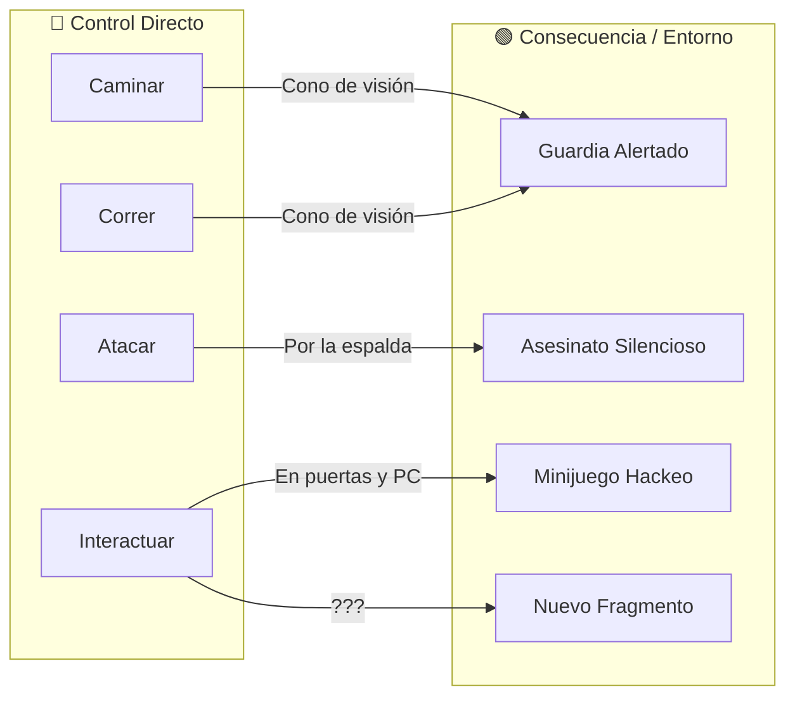

Las acciones básicas que realiza el jugador (**Control Directo**) y los resultados que provocan en el entorno (**Control Indirecto**).

---

## 📊 Diagrama de Flujo

```mermaid
flowchart LR
    subgraph DIRECTO [🔵 Control Directo]
        Caminar["Caminar"]
        Correr["Correr"]
        Atacar["Atacar"]
        Interactuar["Interactuar"]
    end

    subgraph RESULTADO [🟢 Consecuencia / Entorno]
        Alerta["Guardia Alertado"]
        Kill["Asesinato Silencioso"]
        Hack["Minijuego Hackeo"]
        Fragmento["Nuevo Fragmento"]
    end

    Caminar & Correr -->|Cono de visión| Alerta

    Atacar -->|Por la espalda| Kill

    Interactuar -->|En puertas y PC | Hack
    Interactuar -->|???| Fragmento
```
